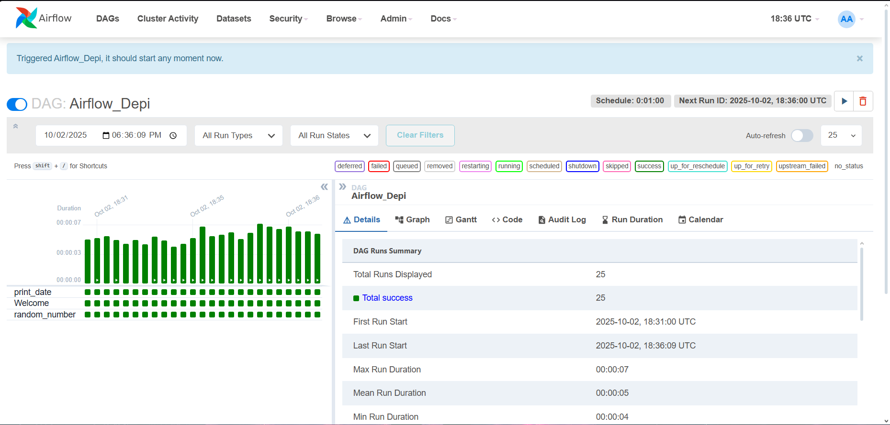
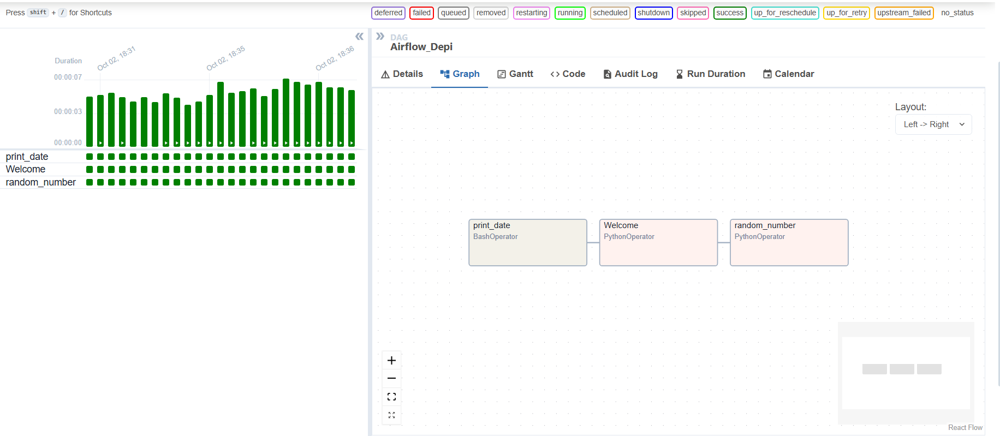
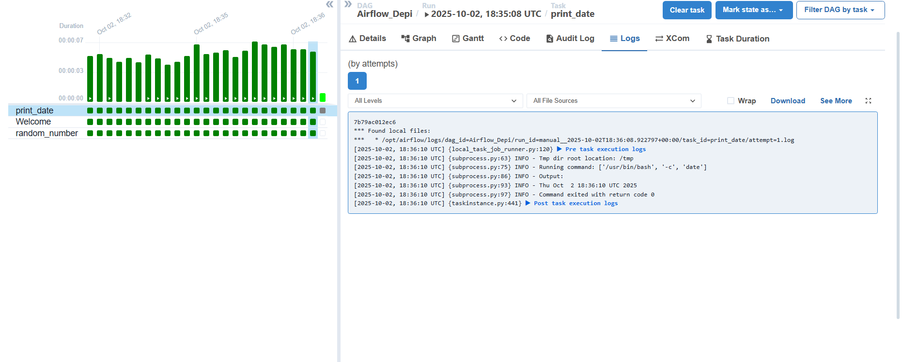
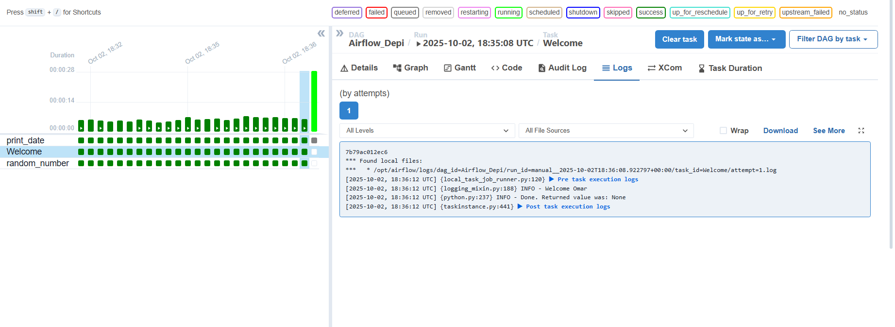
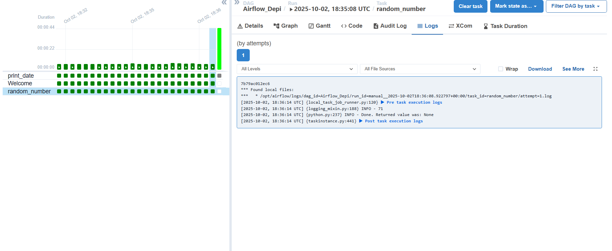

this folder contains:

    airflow code that use DAG to make following:
        1.print date
        2.print welcome message
        3.choose random int from 1 to 100 and save it into random.txt

    yaml file for docker

    a txt file in tmp folder that stores random numbers

DAG overview

DAG graph

first DAG

second DAG

third DAG

